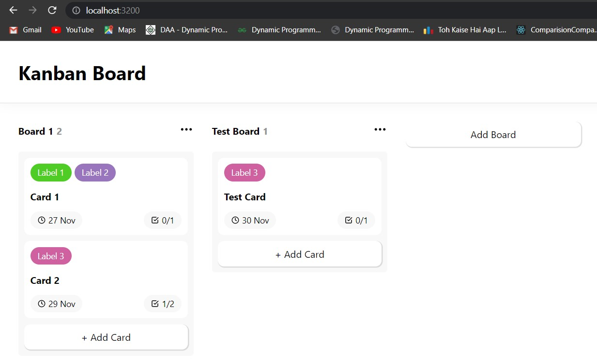
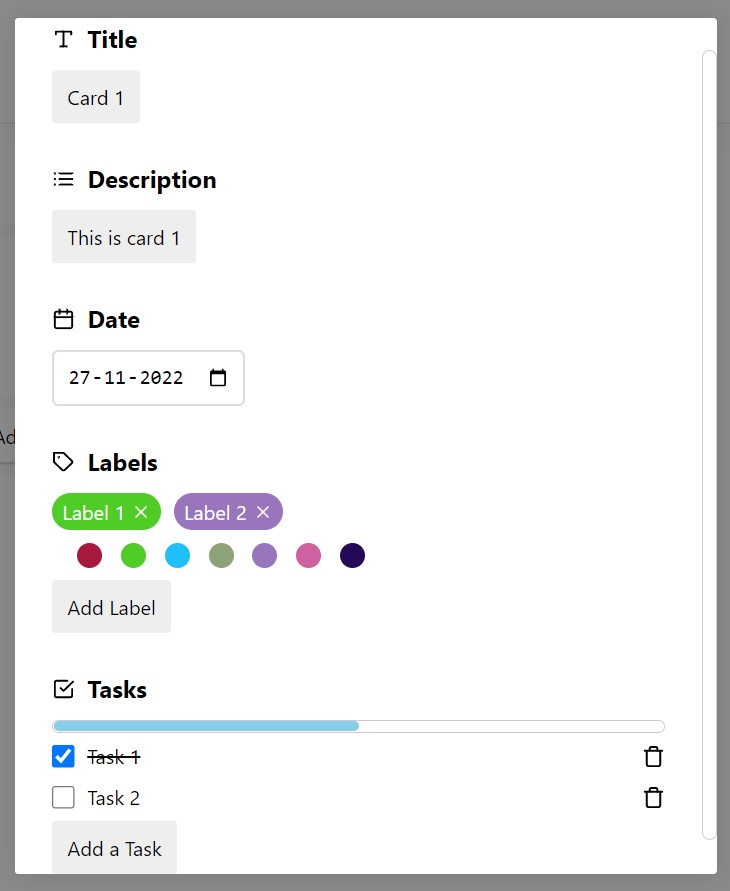

# Kanban Board using React JS

## What is the use of this Repo

This Project is a Kanban Board in ReactJS. Given below are the features of the application:-

1. Addition of cards under the boards.
2. Each card has several features like title, description, date, label(with chosen color code), task(marking undone or finished,deletion).
3. The cards can be updated or deleted anytime as required.
4. Each card can be dragged and dropped under any board(characteristic feature of kanban).
5. Under each board, there is a count of task cards.
6. The tasks under the card can be marked as done or not done.
7. The changes are permanent and aren't lost when page is refreshed.

## Glimpse





## Prerequisites

### Install Node JS

Refer to https://nodejs.org/en/ to install nodejs

### Install create-react-app

Install create-react-app npm package globally. This will help to easily run the project and also build the source files easily. Use the following command to install create-react-app

```bash
npm install -g create-react-app
```

## Cloning and Running the Application in local

Clone the project into local

Install all the npm packages. Go into the project folder and type the following command to install all npm packages

```bash
npm install
```

In order to run the application Type the following command

```bash
npm start
```

The Application Runs on **localhost:3200**

## Packages used

React-feather has been used in order to import certain beautiful icons and UI elements.

## Resources

**create-react-app** : The following link has all the commands that can be used with create-react-app
https://github.com/facebook/create-react-app

**ReactJS** : Refer to https://reactjs.org/ to understand the concepts of ReactJS
